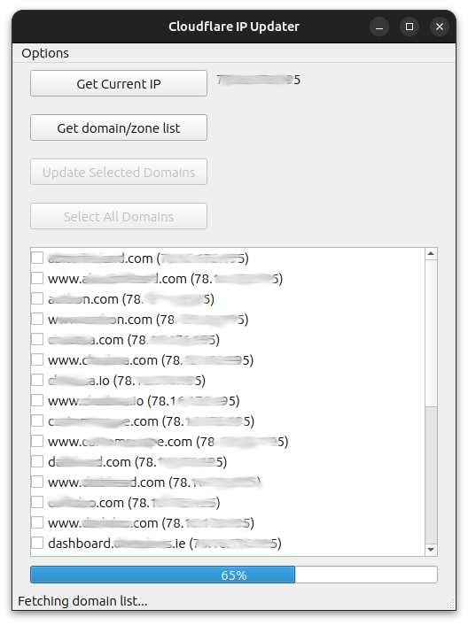

# Cloudflare Zone Updater GUI
Mass update cloudflare domains/zones with your current IP address. 
As I host a lot of websites at home, Cloudflare Proxy is a great way to 
make sure my home IP address isn't exposed. But when my ISP rotates my IP, 
it means I have to update hundreds of Zone entries. This GUI tool is 
something I whipped together to update them all quickly in a user-friendly 
way. This is my first try at a desktop Graphical User Interface so buyer 
beware and all that. 

# Usage
To use, run zoneupdater.py. Make sure you click "options" then "set API token".
Once set, you can get your zones and update them. Please note that this uses
cloudflare API tokens, not API keys. You can get your API token from the profile
section in your cloudflare account.

# Notes
This is basically a scratch project. I wrote it in an evening, and it has
only been tested on Ubuntu. If you use this and spot any bugs or have any 
feature requests, please let me know. I'd be happy to add fix any bugs and 
will definitely consider any feature requests. Also, feel free to fork and
submit a PR if you prefer. I'm sure there's tonnes of bugs.

# ToDo:
- [x] Add support for adding API key/token to keyring, env or config file.
- [x] Auto refresh domains list after update.
- [x] Add about section and licence.
- [x] Make executable.
- [ ] Add support for enabling a service or auto updating on WAN change.
- [ ] Add tests.